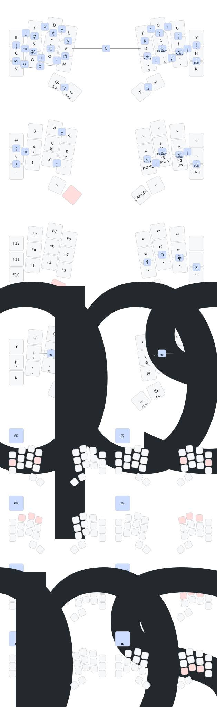

# Sessile


*Sessile* is a further exploration of "minimal" finger travel.

## What Even Is 'Minimal Finger Travel' Anyway?

Probably the least amount of finger travel would be not moving them at all. That would be 10 keys...

```math
combos_{10\,keys} = \sum_{r=1}^{10} C(10, r) = 1023
```

...yielding 1023 possible combinations. 

More realistically, we might consider excluding cross hand combinations so that modifiers might be used. That would give us 

```math
combos_{5\,keys} = \sum_{r=1}^{5} C(5, r) = 31
```

So, with only 5 keys on both hands, and no cross hand combos, we would have a total of 62 possible keys per layer—more than sufficient.

I wasn't quite ready to take on learning to type on that though, so just avoiding lateral reaches seemed like a start. 🙃


## Features

- Sessile uses KLP-Lame keycaps. Larger caps may be tight, especially on the bottom row. I was lazy and didn't model the tilted keycaps in the rendering, but they're much nicer for the vertical combos.

- Uses battery LIR1254. DO NOT substitute LR44. 

- The high speed pins were left available for encoders and *could* be wired in a subsequent revision.

- Built with RMK. ~~Combos soon to follow upon upstream merge.~~ Combos are here! But only 8 of them at a time. Configure them in [Vial](https://get.vial.today).

## Production Files

You can find the gerbers, bom, and cpl for JLC [here](board/output/pcbs/jlcpcb/production_files/). Finished boards are available [here](https://octule.com/listing/1842172090/sessile)


## Origin

*Sessile* was produced using [studyofhands](https://github.com/willpuckett/studyofhands). 


## Firmware

This board is punk rock and is designed for RMK. 😏

Using a dongle will greatly increase battery life.

### RMK

RMK can be configured for dongle mode but currently only has pre-built firmware in [central mode](rmk/sessile.uf2).


RMK can be configured via [Vial](https://get.vial.today). If you intend to use vial, you need to change the following line in `keyboard.toml` and rebuild the firmware.

```diff
[storage]
- clear_storage = true
+ clear_storage = false
``` 

### ZMK

>  [!IMPORTANT]
>  If you are still using [sessile-template](https://github.com/willpuckett/sessile-template/) to build zmk, you need to change [west.yml](https://github.com/willpuckett/sessile-template/blob/main/config/west.yml) to point to zmk branch of this repo.

```diff
manifest:
  remotes:
    - name: zmkfirmware
      url-base: https://github.com/zmkfirmware
    # Additional modules containing boards/shields/custom code can be listed here as well
    # See https://docs.zephyrproject.org/3.2.0/develop/west/manifest.html#projects
    - name: willpuckett
      url-base: https://github.com/willpuckett
  projects:
    - name: zmk
      remote: zmkfirmware
      revision: main
      import: app/west.yml
    - name: sessile
      remote: willpuckett
-     revision: main
+     revision: zmk 
      import: config/west.yml
  self:
    path: config
```


## Keymap

> [!WARNING]
> This keymap is probably somewhat outdated!




## Matrix Diagram

Sessile uses the following pinout for its matrix:


Referencing [this pinout sheet provided by Seeed](https://files.seeedstudio.com/wiki/XIAO-BLE/XIAO-nRF52840-pinout_sheet.xlsx), the only two exposed high speed pins P0_04/SDA/D4 & P0_05/SCL/D5 have been left available for possible encoders in a subsequent revision.