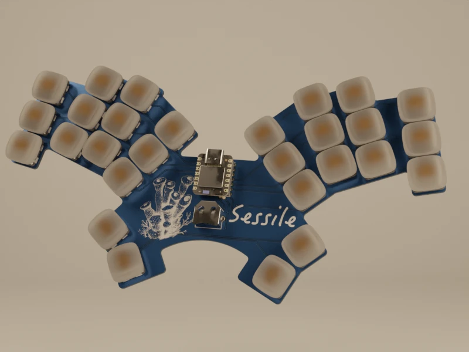
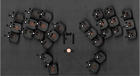
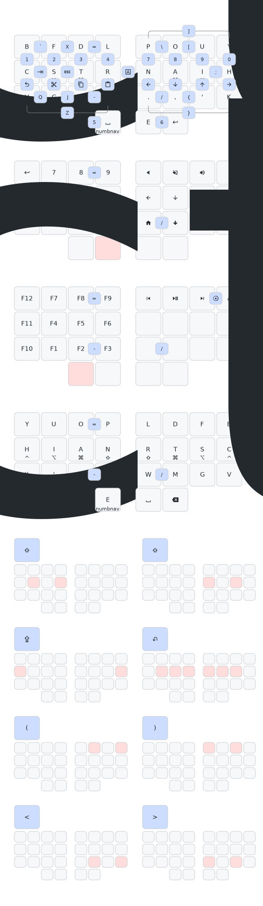
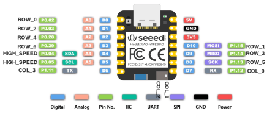

# 🧽 Sessile



[](https://github.com/willpuckett/sessile/actions/workflows/rmk.yml)
[](https://github.com/willpuckett/sessile/actions/workflows/keymap.yml)

_Sessile_ is a further exploration of "minimal" finger travel.

## 🤔 What Even Is 'Minimal Finger Travel' Anyway?

Probably the least amount of finger travel would be not moving them at all. That
would be 10 keys...

```math
combos_{10\,keys} = \sum_{r=1}^{10} C(10, r) = 1023
```

...yielding **1023** possible combinations.

More realistically, we might consider excluding cross hand combinations so that
modifiers might be used. That would give us

```math
combos_{5\,keys} = \sum_{r=1}^{5} C(5, r) = 31
```

So, with only 5 keys on both hands, and no cross hand combos, we would have a
total of **62** possible keys per layer—more than sufficient.

I wasn't quite ready to take on learning to type on that though, so just
avoiding lateral reaches seemed like a start. 🙃

## ✨ Features

- 🧩 Sessile uses KLP-Lame keycaps. Larger caps may be tight, especially on the
  bottom row. I was lazy and didn't model the tilted keycaps in the rendering,
  but they're much nicer for the vertical combos.

- 🔋 Uses battery LIR1254. **DO NOT substitute LR44.**

- 🔌 The high speed pins were left available for encoders and _could_ be wired
  in a subsequent revision.

- ⚙️ Built for RMK. Configure using [Vial](https://get.vial.today).

## 📦 Production Files

You can find the gerbers, bom, and cpl for JLC
[here](board/output/pcbs/jlcpcb/production_files/). Finished boards are
~~available~~ [sold out](https://octule.com/listing/1842172090/sessile) till the
next batch.

## 🎨 Origin

_Sessile_ was produced using
[studyofhands](https://github.com/willpuckett/studyofhands).



## 🚀 Firmware

This board is designed for RMK. 😏

### 🦀 RMK

Current RMK build is available in the
[Releases](https://github.com/willpuckett/sessile/releases/latest).

You can build the firmware yourself by cloning this repository and running

```bash
cd rmk && cargo make uf2 --release
```

> [!TIP] If you haven't previously used Rust to build software for nRF52840, you
> may need to follow the
> [Setup RMK Environment](https://rmk.rs/guide/user_guide/2-2_local_compilation#setup-rmk-environment)
> instructions.

## 🗺️ Keymap

<div style="text-align: center;">



Generated with [keymap-drawer](https://github.com/caksoylar/keymap-drawer/tree/main). 

Physical layout imported from KiCad via [keymap-layout-tools](https://nickcoutsos.github.io/keymap-layout-tools/).

</div>

## 🔌 Matrix Diagram

Sessile uses the following pinout for its matrix:



> [!NOTE] Referencing
> [this pinout sheet provided by Seeed](https://files.seeedstudio.com/wiki/XIAO-BLE/XIAO-nRF52840-pinout_sheet.xlsx),
> the only two exposed high speed pins P0_04/SDA/D4 & P0_05/SCL/D5 have been
> left available for possible encoders in a subsequent revision.
